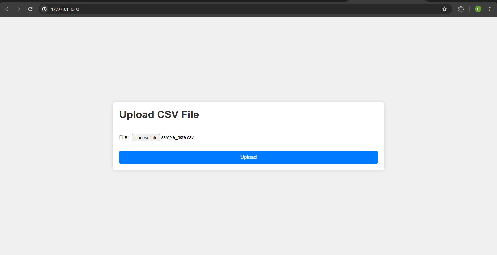
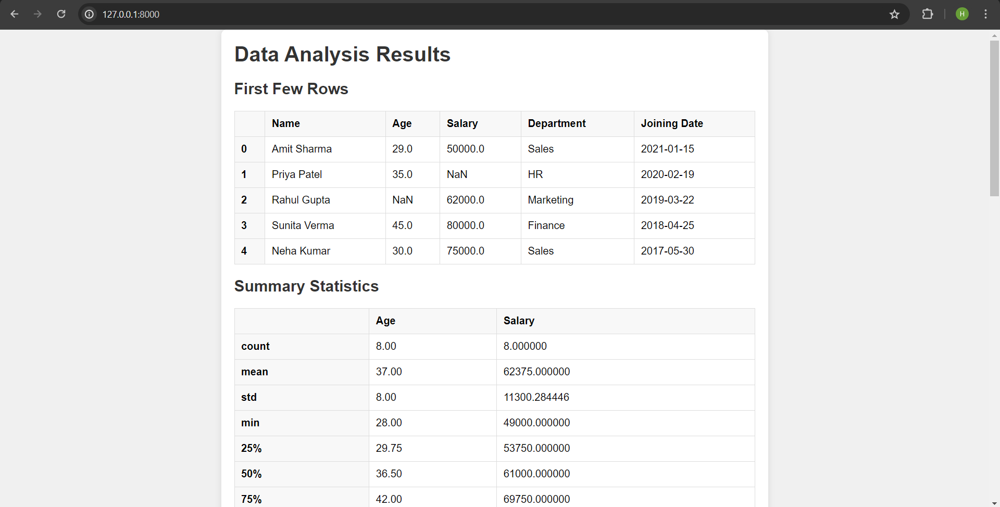
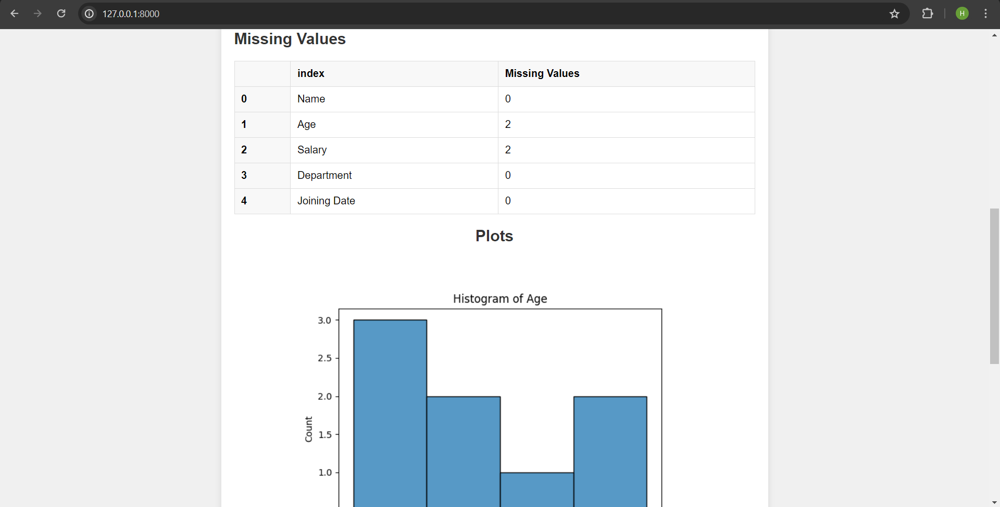
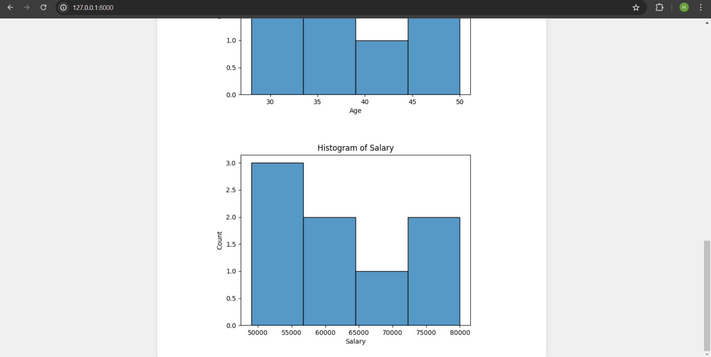

# Django CSV Data Analysis Web Application

This is a Django-based web application that allows users to upload CSV files, performs data analysis using pandas and numpy, and displays the results and visualizations on the web interface.

## Features

- Upload CSV files through a web form.
- Display the first few rows of the uploaded data.
- Calculate summary statistics (mean, median, standard deviation) for numerical columns.
- Identify and handle missing values.
- Generate and display basic plots such as histograms for numerical columns.

## Requirements

- Python
- Django
- pandas
- numpy
- matplotlib
- seaborn

## Setup Instructions

### Step 1: Clone the Repository - 
     
      https://github.com/Harsh-Trivedii/assign_ve3.git
     
      
### Step 2: Install the required dependencies-
     
     pip install -r requirements.txt
     
     
### Step 3: Start the development server-
- Launch the Django development server:
     ```
     python manage.py runserver
     ```
### Step 4: Upload the csv file - 
- sample_data.csv


## Explanation-

### Create Django project and Application
### configure the app in settings.py
### create forms.py and create a form for uploading csv files
### create templates and static folder in root directory and configure them in settings.py file.
### Inside views.py, create upload_file view that contains the main logic for file upload and data analysis
#### Purpose
The purpose of the `upload_file` function is to receive the uploaded CSV file from the user, process it, and display the analysis results on the web interface. This function is responsible for reading the CSV file, performing data analysis tasks using pandas and numpy, generating visualizations, and rendering the results on the web page.

#### Implementation
The `upload_file` function is typically defined in the views.py file of a Django app. It is associated with a URL pattern that maps to a specific endpoint where users can access the file upload form. When a user submits the form with a CSV file, the `upload_file` function is called to handle the request.


## User Interface

### CSV File upload template-


### Displays the results and visualizations on the web interface





